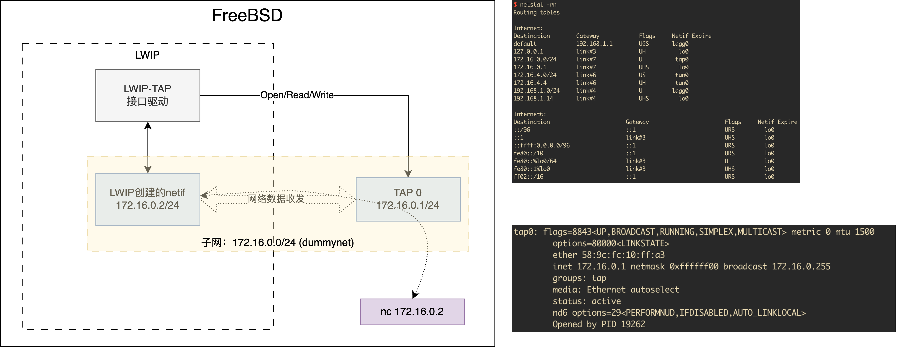

# LWIP低功耗优化
在低功耗场景下，LWIP主线程会被cyclic timer频繁唤醒，但每次唤醒并不是因为有真正的事件要处理。为了功耗更优，需要为LWIP的timeouts引入tickless机制，事件到来的时刻再唤醒，其余时间处于睡眠状态。

## 需要处理的timer
1. TCP Fast/Slow timer (Done)
2. ARP Timer (Doing)
3. DHCP Timer (Doing)
4. DNS Timer (Doing)

# 构建
```shell
$ ./configure
$ gmake
```

# 如何测试
在FreeBSD上使用IPFW和Dummynet构造可量化的丢包、延迟、带宽的网络环境。


### FreeBSD + Dummynet配置

```shell
# 创建tap0设备
sudo ifconfig tap0 create

# 加载dummynet模块
sudo kldload dummynet

# 把所有通过tap0的流量，全部通过pipe10（使用IPFW防火墙）
sudo ipfw add 41 pipe 10 ip from any to any via tap0

# 创建pipe10，指定延迟100ms、带宽10Mbit/s，丢包率 40%
sudo ipfw pipe 10 config delay 100 bw 10Mbit/s plr 0.4

# 使用GDB执行lwip-lowpower程序
sudo gdb --args ./lwip-lowpower -i name=tap0,addr=172.16.0.2,netmask=255.255.255.0,gw=172.16.0.1
```
在FreeBSD上只能看到tap0设备，它的IP是172.16.0.1/24，lwip的netif的IP是172.16.0.2。

## 与LWIP的TCP Echo demo通信
```
# tcp连接lwip tcpe cho服务（端口7），此时向nc标准输入的数据都会echo到标准输出。
nc 172.16.0.2 7
```
如果lwip的tcp echo在30s没有任何数据，会主动输出55个5。代码在lwip-contrib/apps/tcpecho/tcpecho.c